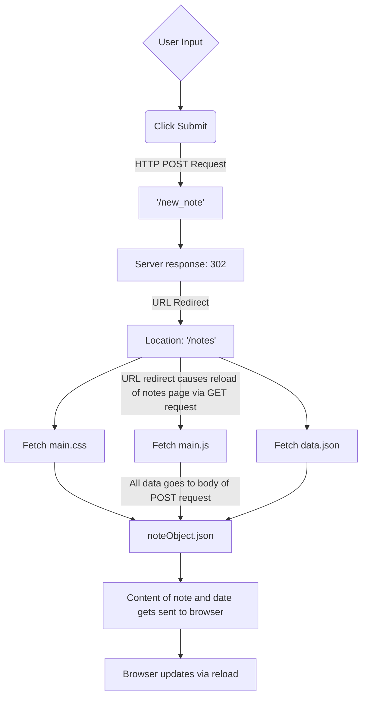
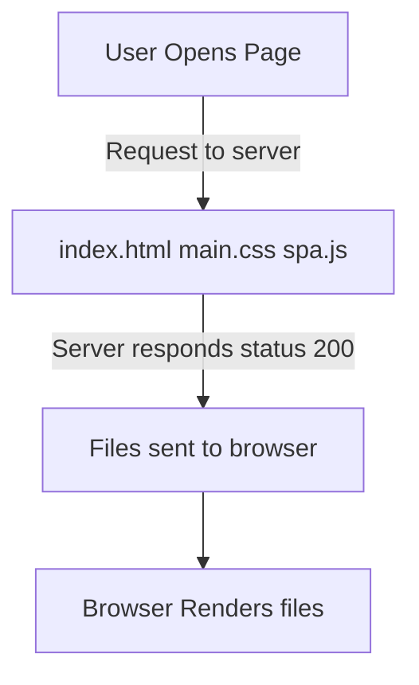
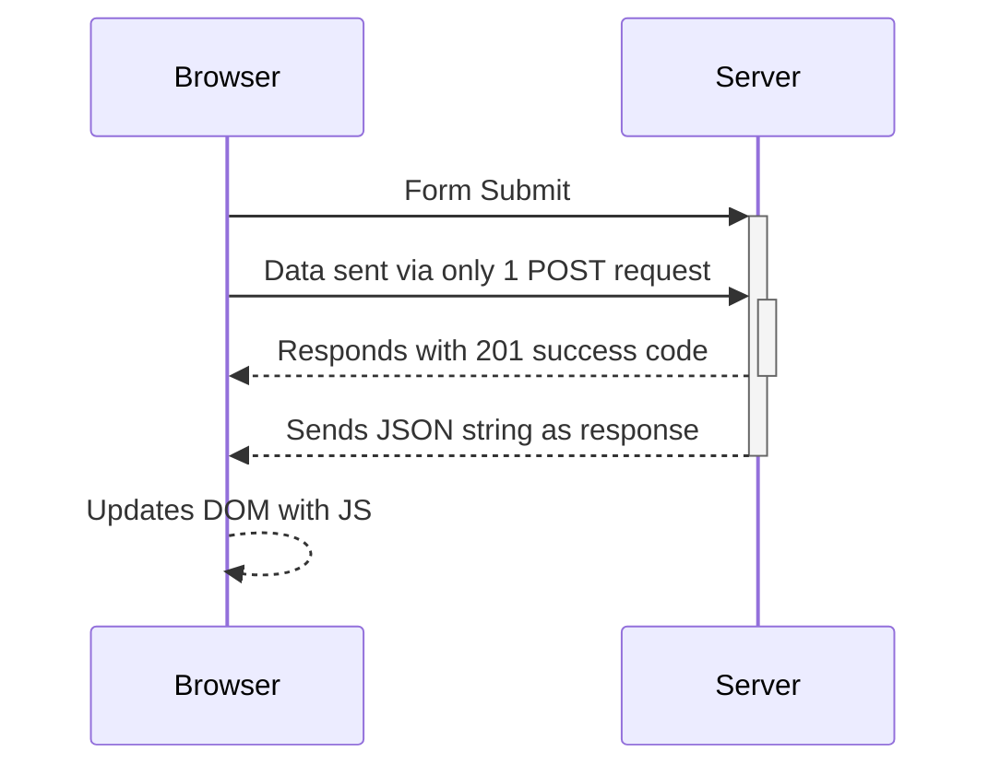

## New Note Diagram 0.4

```mermaid

flowchart TD
    A{User Input}
    A-->B(Click Submit)-->|HTTP POST Request|C['/new_note']
    C-->D[Server response: 302]
    D-->|URL Redirect|E[Location: '/notes']
    E-->F[Fetch main.css]
    E-->|URL redirect causes reload of notes page via GET request|G[Fetch main.js]
    E-->H[Fetch data.json]
    F-->I[noteObject.json]
    G-->|All data goes to body of POST request|I
    H-->I
    I-->J[Content of note and date gets sent to browser]
    J-->K[Browser updates via reload]


```

## SPA Diagram 0.5

```mermaid

flowchart TD
    A[User Opens Page]-->|Request to server|B[index.html main.css spa.js]
    B-->|Server responds status 200|D[Files sent to browser]
    D-->E[Browser Renders files]


```

## SPA New Note Diagram 0.6

```mermaid

sequenceDiagram
    Browser->>+Server: Form Submit
    Browser->>+Server: Data sent via only 1 POST request
    Server-->>-Browser: Responds with 201 success code
    Server-->>-Browser: Sends JSON string as response 
    Browser-->>+Browser: Updates DOM with JS

```